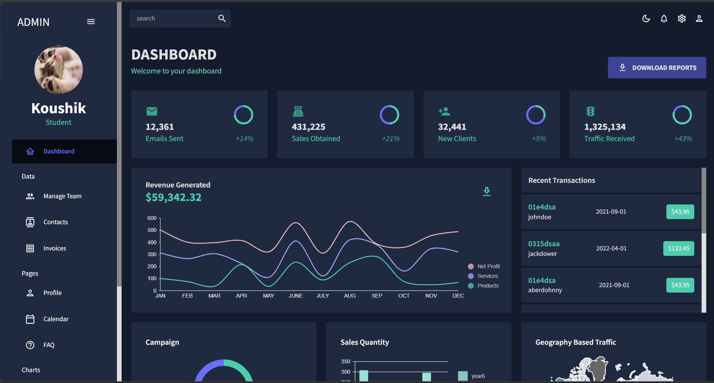

# 💸 Finance Dashboard with Predictions

A full-featured Finance Dashboard built using **React**, **Material UI**, **Nivo Charts**, and **Machine Learning**. Users can view, track, and analyze their expenditure using interactive charts and predictive models.



---

## 🔍 Features

- 📊 **Interactive Dashboard** with summary cards
- 📈 **Visual Charts** (Line, Bar, Pie, Geo) using Nivo
- 📅 **Transaction Timeline** with categorized spending
- 🧠 **ML-based Forecasting** for future expenditure (via regression)
- 🎨 **Dark/Light Mode** with custom theming (MUI)
- 🧭 Sidebar Navigation with active route highlighting
- 🧾 Downloadable Reports (PDF/CSV)

---

## 🧪 Tech Stack

| Tech         | Description                        |
|--------------|------------------------------------|
| React        | Frontend library                   |
| MUI          | UI components + theming            |
| Nivo         | Data visualization (charts)        |
| React Router | Routing between pages              |
| ML (Tensorflow.JS/CSV)  | Linear Regression on CSV|

---

## 🚀 Getting Started

### 📦 Prerequisites

- Node.js (v14+)
- npm / yarn

### 📥 Installation

```bash
git clone https://github.com/your-username/finance-dashboard.git
cd finance-dashboard
npm install

src/
├── components/       # Reusable UI components
├── pages/            # Dashboard, Charts, Reports, Predict
├── data/             # Sample data & ML CSVs
├── theme/            # MUI tokens and themes
├── App.jsx           # Main entry point
├── index.js          # Root render

## 🙌 Acknowledgments
Nivo Charts 

Material UI

Tensorflow.js

React Pro Sidebar
